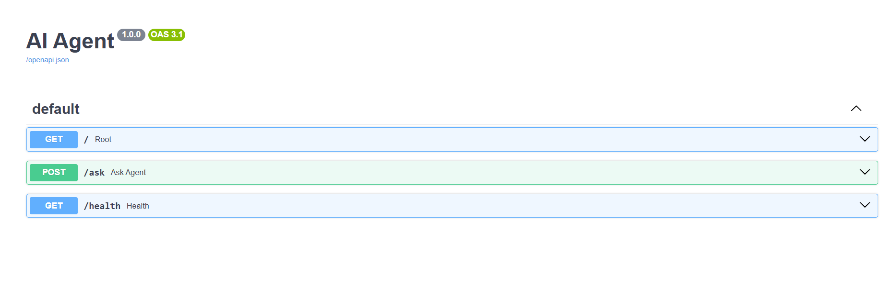

> **Student Name:** Trần Hoàng Hà
> **Student ID:** 2A202600612  
> **Date:** 12/06/2026

## Part 1: Localhost vs Production

### Exercise 1.1: Anti-patterns found

Đọc `01-localhost-vs-production/develop/app.py` — các vấn đề (anti-patterns) tìm được:

1. **Hardcode secrets trong source code** (dòng 17–18)
  - `OPENAI_API_KEY` và `DATABASE_URL` (kèm username/password) viết thẳng trong file.
  - Nếu push lên Git → key/password bị lộ công khai.
2. **Không có config management** (dòng 20–22)
  - `DEBUG`, `MAX_TOKENS` hardcode, không đọc từ environment variables.
  - Khó thay đổi giữa dev / staging / production mà không sửa code.
3. **Dùng `print()` thay vì logging chuẩn** (dòng 33–38)
  - Log debug bằng `print()`, không có level, format, hay timestamp.
  - Còn **in API key ra console** (`print(f"... Using key: {OPENAI_API_KEY}")`) — rò rỉ secret qua log.
4. **Không có health check endpoint** (dòng 42–43)
  - Không có `/health` hoặc `/ready`.
  - Khi deploy lên cloud, platform không biết app còn sống để restart hoặc route traffic.
5. **Host và port cố định, không đọc từ env** (dòng 51–52)
  - `host="localhost"` — chỉ nhận kết nối từ máy local, không chạy được trong Docker/container.
  - `port=8000` cứng — Railway/Render inject `PORT` qua env, app sẽ không bind đúng port.
6. **Bật debug reload khi chạy server** (dòng 53)
  - `reload=True` chỉ dùng khi dev; trong production gây restart liên tục và không ổn định.
7. **Không có graceful shutdown**
  - Không xử lý `SIGTERM` — khi platform tắt container, request đang chạy có thể bị cắt đột ngột.

### Exercise 1.3: Comparison table


| Feature      | Develop                                                               | Production                                                       | Why Important?                                                                       |
| ------------ | --------------------------------------------------------------------- | ---------------------------------------------------------------- | ------------------------------------------------------------------------------------ |
| Config       | Hardcode trong code (`DEBUG=True`, `MAX_TOKENS=500`, API key, DB URL) | Đọc từ env qua `config.py` + file `.env` (`load_dotenv`)         | 12-Factor: config tách khỏi code; đổi dev/staging/prod không cần rebuild             |
| Secrets      | `OPENAI_API_KEY`, `DATABASE_URL` viết thẳng trong `app.py`            | Lưu trong `.env` / env vars platform, không có trong source      | Tránh lộ key khi push Git; mỗi môi trường dùng secret riêng                          |
| Health check | Không có `/health`, `/ready`                                          | Có `/health` (liveness), `/ready` (readiness), `/metrics`        | Cloud platform dùng để biết app còn sống, có nhận traffic không; tự restart khi fail |
| Logging      | `print()` debug, in cả API key ra console                             | Structured JSON logging (`logger.info`), không log secrets       | Log dễ search/parse (Datadog, Loki); tránh rò rỉ dữ liệu nhạy cảm                    |
| Shutdown     | Tắt đột ngột (`Ctrl+C`), không xử lý signal                           | `lifespan` + handler `SIGTERM`, chờ request in-flight hoàn thành | Deploy rolling update không làm mất request đang xử lý                               |
| Host / Port  | `host="localhost"`, `port=8000` cứng                                  | `host=0.0.0.0`, `port` từ `PORT` env var                         | Container/cloud cần bind `0.0.0.0`; Railway/Render inject port động                  |
| Debug mode   | `reload=True` luôn bật                                                | `reload=settings.debug` — chỉ bật khi `DEBUG=true`               | Reload ổn cho dev nhưng không ổn định trên production                                |
| API `/ask`   | Nhận `question` qua query param                                       | Nhận JSON body `{"question": "..."}`, validate input             | Chuẩn REST API; dễ dùng từ frontend/client                                           |
| CORS         | Không cấu hình                                                        | `CORSMiddleware` với `ALLOWED_ORIGINS` từ env                    | Kiểm soát domain nào được gọi API từ browser                                         |


## Part 2: Docker Containerization

### Exercise 2.1: Dockerfile questions (develop)

1. **Base image:** `python:3.11` — bản Python đầy đủ (~1 GB), có sẵn pip và build tools.
2. **Working directory:** `/app` — mọi lệnh `COPY`, `RUN` sau đó chạy trong thư mục này.
3. **Tại sao COPY requirements.txt trước?** Docker cache theo layer. Nếu chỉ code thay đổi mà `requirements.txt` không đổi → layer `pip install` được tái sử dụng → build nhanh hơn.
4. **CMD vs ENTRYPOINT:**
  - `ENTRYPOINT` — lệnh cố định, container luôn chạy lệnh này (khó override hoàn toàn).
  - `CMD` — lệnh mặc định, có thể override khi `docker run` (ví dụ `docker run image bash`).
  - Dockerfile develop dùng `CMD ["python", "app.py"]`.

### Exercise 2.2: Build và run (develop)

**Lệnh đã chạy:**

```powershell
cd d:\AI\Day12\day12_ha-tang-cloud_va_deployment
docker build -f 02-docker/develop/Dockerfile -t agent-develop .
docker run -p 8000:8000 agent-develop
```

**Test:**

```powershell
curl.exe "http://localhost:8000/ask?question=What is Docker?" -X POST
curl.exe http://localhost:8000/health
```

**Kết quả quan sát:**

- Image `agent-develop` size: **1.66 GB** (Docker Desktop / `docker images`)
- Container chạy OK, API trả về `{"answer": "..."}` từ mock LLM
- Image lớn vì dùng `python:3.11` full + pip + toàn bộ dependencies trong một stage

### Exercise 2.3: Multi-stage build (production)

**Stage 1 — `builder` (`python:3.11-slim`):**

- Cài `gcc`, `libpq-dev` để compile dependencies
- `pip install --user` packages vào `/root/.local`
- Stage này **không** deploy, chỉ dùng để build

**Stage 2 — `runtime` (`python:3.11-slim`):**

- Tạo user `appuser` (non-root) — bảo mật
- Copy chỉ `/root/.local` (packages) và `main.py` + `mock_llm.py` từ builder
- Không có gcc, pip cache, build tools → image gọn hơn nhiều
- `HEALTHCHECK` + `uvicorn` với 2 workers

**Tại sao image nhỏ hơn?**

- Base `slim` thay vì full Python
- Bỏ build tools (gcc, libpq-dev) khỏi image cuối
- Multi-stage chỉ copy artifact cần chạy, không copy layer build

### Exercise 2.3: Image size comparison


| Image              | Tag    | Size        |
| ------------------ | ------ | ----------- |
| `agent-develop`    | latest | **1.66 GB** |
| `production-agent` | latest | **236 MB**  |


- Develop: **1660 MB**
- Production: **236 MB**
- Difference: Production nhỏ hơn **~86%** (giảm ~1424 MB)
- Production đạt mục tiêu lab **< 500 MB**

### Exercise 2.4: Docker Compose stack

**Lệnh đã chạy:**

```powershell
docker compose -f 02-docker/production/docker-compose.yml up -d
```

**4 services được start:**


| Service  | Image                            | Vai trò                                    |
| -------- | -------------------------------- | ------------------------------------------ |
| `agent`  | `production-agent` (build local) | FastAPI AI agent                           |
| `redis`  | `redis:7-alpine`                 | Cache session, rate limiting               |
| `qdrant` | `qdrant/qdrant:v1.9.0`           | Vector DB cho RAG                          |
| `nginx`  | `nginx:alpine`                   | Reverse proxy, load balancer (port **80**) |


**Architecture (luồng request):**

```
Client → Nginx (:80) → Agent (:8000, internal)
                          ↓
                    Redis (:6379) + Qdrant (:6333)
```

- `agent` **không** expose port ra host — chỉ truy cập qua Nginx
- Các service giao tiếp qua network `production_internal` (tên DNS: `agent`, `redis`, `qdrant`)
- `agent` chờ `redis` và `qdrant` healthy (`depends_on` + `condition: service_healthy`) rồi mới start

**Test kết quả:**

```powershell
curl.exe http://localhost/health
# → {"status":"ok","uptime_seconds":19.7,"version":"2.0.0",...}

curl.exe http://localhost/ask -X POST -H "Content-Type: application/json" -d "{\"question\": \"Explain microservices\"}"
```

**Xem trong Docker Desktop:** Containers → nhóm `production` (4 containers Running)

## Part 3: Cloud Deployment

### Exercise 3.1: Cloud deployment (Vercel)

- **Platform:** Vercel (serverless FastAPI — thay Railway theo yêu cầu lab)
- **URL:** [https://day12-ha-tang-cloud-va-deployment.vercel.app](https://day12-ha-tang-cloud-va-deployment.vercel.app)
- **Docs:** [https://day12-ha-tang-cloud-va-deployment.vercel.app/docs](https://day12-ha-tang-cloud-va-deployment.vercel.app/docs)
- **Chi tiết deploy:** xem [`DEPLOYMENT.md`](DEPLOYMENT.md)

**Cấu hình Vercel:**

| File | Vai trò |
|------|---------|
| `api/index.py` | FastAPI app — export `app` (ASGI native, không dùng Mangum) |
| `vercel.json` | Rewrite all routes → `/api/index` |
| `requirements.txt` | `fastapi`, `pydantic` |
| `runtime.txt` | `python-3.11` (tránh lỗi Python 3.12 trên Vercel) |

**Env vars trên Vercel Dashboard → Settings → Environment Variables:**

- `AGENT_API_KEY` = `dev-key-change-me-in-production` (hoặc key riêng)

**Lỗi đã fix:** Build xong nhưng 500 `FUNCTION_INVOCATION_FAILED` do Mangum + Python 3.12. Fix: bỏ Mangum, export `app` trực tiếp, pin Python 3.11.

**Test sau deploy:**

```powershell
Invoke-RestMethod https://day12-ha-tang-cloud-va-deployment.vercel.app/health
Invoke-RestMethod https://day12-ha-tang-cloud-va-deployment.vercel.app/ready

Invoke-RestMethod -Uri https://day12-ha-tang-cloud-va-deployment.vercel.app/ask -Method POST `
  -Headers @{"X-API-Key"="dev-key-change-me-in-production"} `
  -ContentType "application/json" `
  -Body '{"user_id":"test","question":"What is deployment?"}'
```

**Screenshot:** [Mở file ảnh](./screenshot/ex03.png)

[](./screenshot/ex03.png)

---

## Part 4: API Security

### Exercise 4.1: API Key authentication (develop)

**Lệnh chạy (PowerShell):**

```powershell
cd d:\AI\Day12\day12_ha-tang-cloud_va_deployment\04-api-gateway\develop
$env:AGENT_API_KEY="my-secret-key"
python app.py
```

**Câu hỏi lab:**

1. **API key được check ở đâu?**
  - Hàm `verify_api_key()` (dependency) — đọc header `X-API-Key` qua `APIKeyHeader`
  - Inject vào `POST /ask` bằng `Depends(verify_api_key)` (dòng 70)
2. **Điều gì xảy ra nếu sai key?**
  - Không gửi key → **401** `Missing API key`
  - Key sai → **403** `Invalid API key`
  - Key đúng → **200** + JSON `question`, `answer`
3. **Làm sao rotate key?**
  - Đổi biến môi trường `AGENT_API_KEY` trên server (Railway/Vercel/Docker env)
  - Restart app → key cũ hết hiệu lực ngay
  - Không hardcode trong source code; cấp key mới cho client qua kênh bảo mật

**Kết quả test (PowerShell — `Invoke-RestMethod`):**

```powershell
# Có key → 200
Invoke-RestMethod -Uri http://localhost:8000/ask -Method POST `
  -Headers @{"X-API-Key"="my-secret-key"} `
  -ContentType "application/json" -Body '{"question":"hello"}'

# Không key → 401
# Key sai → 403
```


| Test                          | Status | Response                              |
| ----------------------------- | ------ | ------------------------------------- |
| Có `X-API-Key: my-secret-key` | 200    | `{"question":"hello","answer":"..."}` |
| Không có key                  | 401    | `Missing API key`                     |
| Key sai                       | 403    | `Invalid API key`                     |


**Ghi chú:** Test qua Swagger UI (`/docs`) — Authorize với API key; endpoint không hiện request body vì code dùng `request.json()` thay vì Pydantic model.

---

### Exercise 4.2: JWT authentication (production)

**JWT flow:**

```
POST /auth/token (username + password)
    → server tạo JWT (HS256, expiry 60 phút)
    → client gửi: Authorization: Bearer <token>
    → verify_token() decode + kiểm tra signature/expiry
    → /ask xử lý request
```

**Demo credentials:**


| User      | Password   | Role  | Rate limit   |
| --------- | ---------- | ----- | ------------ |
| `student` | `demo123`  | user  | 10 req/phút  |
| `teacher` | `teach456` | admin | 100 req/phút |


**Lệnh test (PowerShell):**

```powershell
cd d:\AI\Day12\day12_ha-tang-cloud_va_deployment\04-api-gateway\production
python app.py

# 1. Lấy token
$r = Invoke-RestMethod -Uri http://localhost:8000/auth/token -Method POST `
  -ContentType "application/json" -Body '{"username":"student","password":"demo123"}'
$TOKEN = $r.access_token

# 2. Gọi /ask với token
Invoke-RestMethod -Uri http://localhost:8000/ask -Method POST `
  -Headers @{Authorization="Bearer $TOKEN"} `
  -ContentType "application/json" -Body '{"question":"Explain JWT"}'
```

**So sánh API Key vs JWT:**


|               | API Key (develop)      | JWT (production)          |
| ------------- | ---------------------- | ------------------------- |
| Stateless     | Có (key cố định)       | Có (token self-contained) |
| Expiry        | Không (đến khi rotate) | Có (60 phút)              |
| User identity | Không                  | Có (`sub`, `role`)        |
| Phù hợp       | MVP, B2B nội bộ        | Multi-user, role-based    |


---

### Exercise 4.3: Rate limiting

**Đọc `rate_limiter.py`:**

1. **Algorithm:** **Sliding Window Counter** — mỗi user có `deque` timestamps; loại request cũ hơn 60 giây trước khi đếm
2. **Limit:**
  - User (`student`): **10 requests / 60 giây** (10/phút)
  - Admin (`teacher`): **100 requests / 60 giây**
3. **Bypass cho admin:** User `teacher` có `role: admin` → dùng `rate_limiter_admin` (limit cao hơn 10×), không bypass hoàn toàn

**Khi vượt limit:** HTTP **429** + headers `X-RateLimit-`*, `Retry-After`

**Luồng bảo vệ (production):**

```
Request → Auth (401) → Rate Limit (429) → Cost Check (402/503) → Agent (200)
```

---

### Exercise 4.4: Cost guard

**Đọc `cost_guard.py`:**


| Tham số              | Giá trị mặc định               |
| -------------------- | ------------------------------ |
| Budget mỗi user/ngày | **$1.00**                      |
| Budget global/ngày   | **$10.00**                     |
| Cảnh báo             | **80%** budget (`warn_at_pct`) |


**Logic `check_budget()`:**

1. Reset record theo ngày (`YYYY-MM-DD`)
2. Kiểm tra global budget → vượt → **503** (service unavailable)
3. Kiểm tra per-user budget → vượt → **402** Payment Required
4. Gần hết budget (≥80%) → log warning
5. Sau mỗi request: `record_usage()` cộng token + cost

**Tại sao cần Cost Guard?** Public API + LLM = rủi ro bill cao. Cost guard chặn trước khi gọi model khi hết budget.

---

### Checkpoint 4

- [x] Hiểu API Key authentication và cách test 401/403
- [x] Hiểu JWT flow: login → token → Bearer header
- [x] Biết rate limiting dùng Sliding Window, limit 10 req/phút (user)
- [x] Hiểu cost guard: budget per-user + global, trả 402 khi vượt

---

## Part 5: Scaling & Reliability

> Các concept Part 5 được tích hợp trong `06-lab-complete/` (production stack).

### Exercise 5.1: Health checks

- **`GET /health`** — Liveness probe: trả 200 nếu process còn sống, kèm uptime, checks (Redis, LLM).
- **`GET /ready`** — Readiness probe: trả 200 khi Redis ping OK; **503** nếu chưa sẵn sàng nhận traffic.

```powershell
Invoke-RestMethod http://localhost:8888/health
Invoke-RestMethod http://localhost:8888/ready
```

### Exercise 5.2: Graceful shutdown

- `lifespan` context manager: set `_is_ready = False` khi shutdown.
- `signal.signal(SIGTERM, _handle_signal)` — log signal, uvicorn `timeout_graceful_shutdown=30`.
- Platform (Docker/K8s) gửi SIGTERM → app chờ request in-flight hoàn thành rồi thoát.

### Exercise 5.3: Stateless design

- **Anti-pattern:** `conversation_history = {}` in-memory → mất data khi scale/restart.
- **Correct:** Redis lưu history (`conv:{user_id}`), rate limit (`rate:{user_id}`), cost (`cost:{user_id}:{YYYY-MM}`).
- Agent replicas không chia sẻ memory — mọi state qua Redis.

### Exercise 5.4: Load balancing

- Docker Compose: `docker compose up --scale agent=3`
- Nginx upstream `agent:8000` — Docker DNS round-robin giữa 3 replicas.
- Client → Nginx (:8888) → Agent 1/2/3 → Redis.

### Exercise 5.5: Test stateless

1. Gửi 2 request cùng `user_id` → `history_turns` tăng (1 → 2) dù request có thể vào replica khác.
2. Restart 1 agent container → history vẫn còn trong Redis.
3. `GET /ready` fail khi Redis down → Nginx không route traffic tới agent unhealthy.

---

## Part 6: Final Project (Lab Complete)

### Kiến trúc đã triển khai

```
Client → Nginx (:8888) → Agent × 3 (internal :8000)
                              ↓
                           Redis (session, rate limit, cost, history)
```

**Files chính (`06-lab-complete/`):**


| File                  | Vai trò                                            |
| --------------------- | -------------------------------------------------- |
| `app/main.py`         | FastAPI entry — `/health`, `/ready`, `/ask`        |
| `app/config.py`       | 12-factor config từ env                            |
| `app/auth.py`         | API Key (`X-API-Key`) → 401/403                    |
| `app/rate_limiter.py` | Sliding window trong Redis — 10 req/phút/user      |
| `app/cost_guard.py`   | Monthly budget $10/user trong Redis — 402 khi vượt |
| `app/session.py`      | Conversation history trong Redis (stateless agent) |
| `Dockerfile`          | Multi-stage, non-root, image ~307 MB               |
| `docker-compose.yml`  | agent + redis + nginx                              |
| `DEPLOYMENT.md`       | Public URL + test commands                         |


### Checklist CODE_LAB Part 6

**Functional:**

- [x] Agent trả lời qua REST API `POST /ask`
- [x] Conversation history lưu Redis (`user_id` + `history_turns` trong response)
- [ ] Streaming responses (optional — chưa implement)

**Non-functional:**

- [x] Docker multi-stage build (`agent` image < 500 MB)
- [x] Config từ environment variables
- [x] API key authentication
- [x] Rate limiting 10 req/min/user (Redis ZSET sliding window)
- [x] Cost guard $10/month/user (Redis)
- [x] `GET /health` + `GET /ready` (ready kiểm tra Redis)
- [x] Graceful shutdown (`SIGTERM` handler + uvicorn `timeout_graceful_shutdown`)
- [x] Stateless design — state trong Redis, không in-memory
- [x] Structured JSON logging
- [x] Deploy public URL (Vercel)
- [x] `python check_production_ready.py` → 23/23 checks passed

### Lệnh chạy local

```powershell
cd d:\AI\Day12\day12_ha-tang-cloud_va_deployment\06-lab-complete
cp .env.example .env   # nếu chưa có
docker compose up --build --scale agent=3 -d
python check_production_ready.py
```

### Kết quả test

```powershell
# Health / Ready (qua Nginx)
Invoke-RestMethod http://localhost:8888/health
Invoke-RestMethod http://localhost:8888/ready

# Ask với API key + user_id
Invoke-RestMethod -Uri http://localhost:8888/ask -Method POST `
  -Headers @{"X-API-Key"="dev-key-change-me-in-production"} `
  -ContentType "application/json" `
  -Body '{"user_id":"user1","question":"What is Docker?"}'

# Không có key → 401
# Key sai → 403
```


| Test                 | Kỳ vọng                                 |
| -------------------- | --------------------------------------- |
| `GET /health`        | 200, `status: ok`, `checks.redis: ok`   |
| `GET /ready`         | 200, `ready: true`                      |
| `POST /ask` có key   | 200, `answer`, `history_turns` tăng dần |
| Không có `X-API-Key` | 401                                     |
| Key sai              | 403                                     |
| >10 req/phút/user    | 429                                     |
| Vượt budget tháng    | 402                                     |


### Image size


| Image                   | Size                     |
| ----------------------- | ------------------------ |
| `06-lab-complete-agent` | **~307 MB** (< 500 MB ✅) |


### Deploy

- **Public URL:** [https://day12-ha-tang-cloud-va-deployment.vercel.app](https://day12-ha-tang-cloud-va-deployment.vercel.app)
- **Chi tiết:** xem `06-lab-complete/DEPLOYMENT.md`
- **Render/Railway:** `render.yaml` + `railway.toml` sẵn sàng deploy full Docker stack

### Validation script

```powershell
cd 06-lab-complete
python check_production_ready.py
# → 23/23 checks passed (100%) — PRODUCTION READY
```

